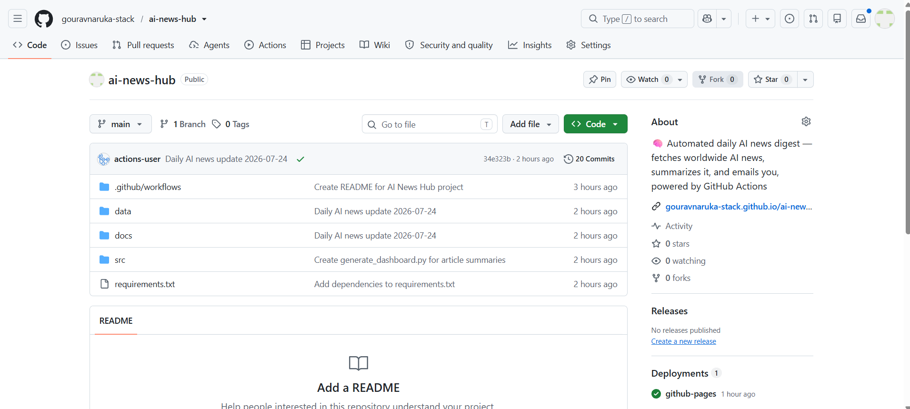

# AI News Hub 🧠📰



Automatically fetches **worldwide AI news every day**, summarizes each article into a **short but detailed** blurb, and publishes it to a clean dashboard plus sends it to your Gmail — all for free, running on GitHub Actions.

## What it does

1. **Fetches** AI-related news daily from:
   - NewsAPI (`ai`, `artificial intelligence`, `machine learning`, `llm` queries)
   - Curated RSS feeds: TechCrunch AI, VentureBeat AI, MIT Technology Review, The Verge AI
2. **Summarizes** each article into a short 2–3 sentence blurb.
3. **Deduplicates** similar stories from different sources.
4. **Publishes** a dashboard (`docs/index.html`) you can view anytime, plus a dated JSON archive in `data/`.
5. **Emails you** the same digest straight to your Gmail inbox.
6. **Runs automatically** every day via GitHub Actions — no server, no manual work.

**Live dashboard**: https://gouravnaruka-stack.github.io/ai-news-hub/

## Secrets used

| Secret name | Purpose |
|---|---|
| `NEWSAPI_KEY` | fetches news articles |
| `GMAIL_ADDRESS` | the Gmail account sending the digest |
| `GMAIL_APP_PASSWORD` | app password for that Gmail account |
| `RECIPIENT_EMAIL` | where the digest gets sent |
| `ANTHROPIC_API_KEY` | optional — enables AI-polished summaries instead of raw article descriptions |

## Project structure

```
ai-news-hub/
├── .github/workflows/daily.yml   # scheduled automation
├── src/
│   ├── fetch_news.py             # pulls articles from NewsAPI + RSS
│   ├── summarize.py               # summarizes with Claude (optional)
│   ├── generate_dashboard.py      # builds docs/index.html
│   └── send_email.py              # emails the digest via Gmail
├── docs/
│   └── index.html                 # published dashboard (GitHub Pages)
├── data/
│   └── YYYY-MM-DD.json            # daily archive of stories + summaries
└── requirements.txt
```
